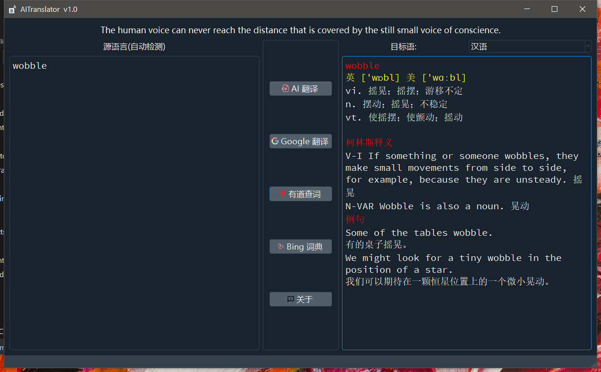
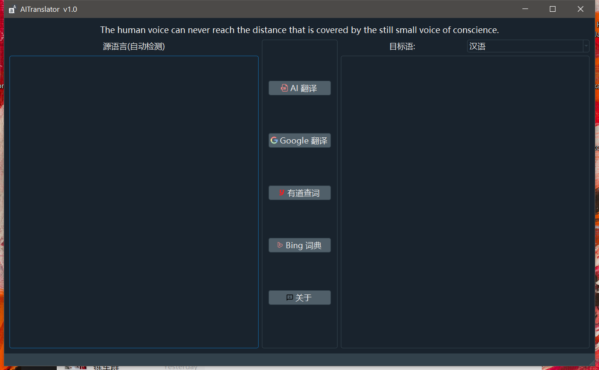

# AITranslator
跨平台翻译软件,支持:  
AI 翻译 -> 汉语，英语，文言文，日语，韩语，法语，西班牙语，泰语，俄语，德语互译。可翻译单词和句子。  
Google 翻译 -> 英语。可翻译单词和句子。  
有道查词 和 Bing词典 -> 仅支持单词查询。

# 开发环境
前端: python + pyqt5   
后端: Java Spring Boot   

# 运行
Windows: 双击exe, (360安全卫士会报病毒,建议卸载360 ^OO^ 软件是纯开源的，duck不必惊慌)  
Linux: 添加可执行权限 (chmod + x)后, ./AITranslator  
Mac & 其他: python3 App.py  

# 贡献
    
    

# 下载地址
可执行文件:  
https://github.com/lsldragon/AITranslator/releases  
Version: 1.0  
Date: 2020.06.04  

# BUGs Feedback & Contact Me
Email: lsldragon@outlook.com

# 截图

  
  
  

# 其他
仅供个人学习，请勿用于商业用途！