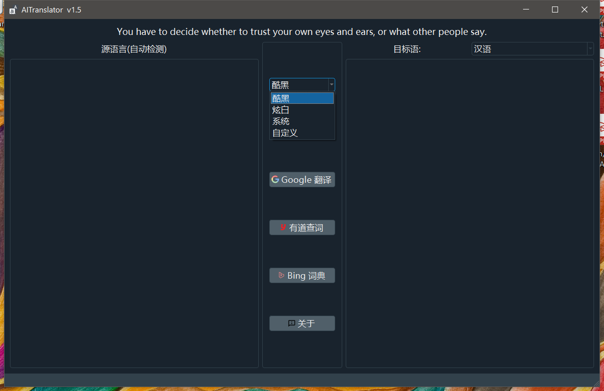
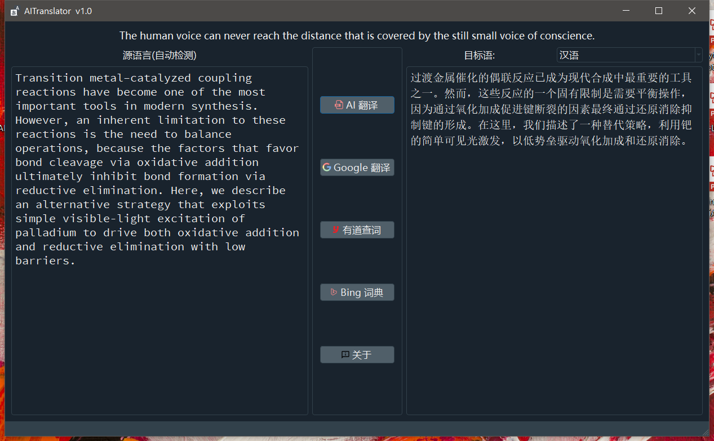

# AITranslator
跨平台翻译软件,支持:  
AI 翻译 -> 汉语，英语，文言文，日语，韩语，法语，西班牙语，泰语，俄语，德语互译。可翻译单词和句子。  
Google 翻译 -> 英语。可翻译单词和句子。  
有道查词 和 Bing词典 -> 仅支持单词查询,附有单词的详解。

# 开发框架
前端: python + pyqt5   
后端: Java Spring Boot   

# 运行
Windows: 双击exe, (360安全卫士会报病毒,建议卸载360 ^OO^ 软件是纯开源的，duck不必惊慌)  
Linux: 添加可执行权限 (chmod + x)后, ./AITranslator  
Mac & 其他: python3 App.py  

# 贡献
    
    

# 下载地址
可执行文件:  
https://github.com/lsldragon/AITranslator/releases  

-------------------------------------------------
Version: 1.0  
Date: 2020.06.04  

Version: 1.5  
更新:   
1. 增加默认的3套主题，并支持自定义主题( .qss 文件,且和软件在同一目录才能加载)  
2. 其他优化和改进  

Version 1.17  
更新:  
1. Google 翻译增强(除文言文外,其他语言皆可翻译)

Version 1.21  
更新: 

1. 有道查词新增词形变化、同义词
2. Bing 新增同义词和反义词查询  
20200621

-------------------------------------------------

# BUGs Feedback & Contact Me
Email: lsldragon@outlook.com

# 截图
  
  
  

# 其他
仅供个人学习，请勿用于商业用途！